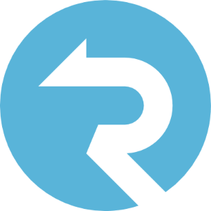

# Real-time Chat Application

Tags: ASP.NET, Figma, Git/GitHub, Javascript/Typescript, MongoDB, NextJS, Postman, ReactJS, SignalR, Tailwindcss

# Chat Application Documentation

<aside>
💡 This documentation provides an overview about Realtime chat application using SignalR with NextJS for building the client side and ASP.NET for creating the APIs in server side based on the Restfull Architecture.

</aside>

 #### **This is the online documentation :**
[Real-time Chat Application](https://www.notion.so/Real-time-Chat-Application-3f1dcfc0ebea4c419b643d44224b3e80?pvs=21)

# Contributors

[ZenaguiAnas - Overview](https://github.com/ZenaguiAnas)

- **Supervised By** :

- **GitHub Repository :**

[https://github.com/ZenaguiAnas/ChatApp](https://github.com/ZenaguiAnas/ChatApp)

# Technologies

## Frameworks

- **ReactJS**
    
    <aside>
    📌 React (also known as React. js or ReactJS) is **a free and open-source front-end JavaScript library for building user interfaces based on components**.
    
    </aside>
    

- **NextJS**
    
    <aside>
    📌 Used by some of the world's largest companies, Next.js enables you to create **full-stack Web applications** by extending the latest React features, and integrating powerful Rust-based JavaScript tooling for the fastest builds.
    
    </aside>
    

- .NET
    
    <aside>
    📌 ***NET*** is a developer platform with tools and libraries for building any type of app, including web, mobile, desktop, games, IoT, cloud, and microservices.
    
    </aside>
    

## Tools

- **Git**
    
    <aside>
    📌 Git is a free and open source distributed version control system designed to handle everything from small to very large projects with speed and efficiency.
    
    </aside>
    

- **GitHub**
    
    <aside>
    📌 GitHub is a for-profit company that offers a cloud-based Git repository hosting service. Essentially, it makes it a lot easier for individuals and teams to use Git for version control and collaboration
    
    </aside>
    

- **SignalR**
    
    <aside>
    📌 **SignalR** is a free and open-source software library for [Microsoft](https://en.wikipedia.org/wiki/Microsoft) [ASP.NET](https://en.wikipedia.org/wiki/ASP.NET) that allows server code to send asynchronous notifications to client-side web applications. The library includes server-side and client-side JavaScript components.
    
    </aside>
    

- **Postman**
    
    <aside>
    📌 Postman can be used **to write functional tests, integration tests, regression tests, and more**. Postman's Node.js-based runtime contains support for common patterns and libraries that you can use to build tests quickly.
    
    </aside>
    

- **Tailwindcss**
    
    <aside>
    📌 ***Tailwind CSS*** is a utility-first CSS framework for rapidly building modern websites without ever leaving your HTML.
    
    </aside>
    

## Best Practices

<aside>
📌 During the building of this application we used some best practices of **DESIGN PATTERNS** like Singleton and Observer and others.

- **`Singleton`**: ***Singleton*** is a creational ***design pattern*** that lets you ensure that a class has only one instance, while providing a global access point to this instance.

- **`Observer`**: **Observer** is a behavioral design pattern that lets you define a subscription mechanism to notify multiple objects about any events that happen to the object they’re observing.

 

</aside>

# Notes

<aside>
📌 Users can now communicate in real-time and enjoy a seamless chat experience. Remember to handle security aspects, user authentication, and any additional features or enhancements you may require for your specific use case. Happy chatting!

</aside>
